# Architecture

> This document describes the original single pipeline (still available with `AGENT_MODE=single`). The multi-agent version is in [multi-agent-architecture.md](multi-agent-architecture.md).

> Portfolio project with **synthetic data**. Items marked **PRODUCTION ENHANCEMENT** are designed but not built.

## 1. Request flow

```mermaid
flowchart TD
    U[User] --> UI[Streamlit UI]
    UI --> API[FastAPI]
    API --> R[AI Router<br/>type + risk + hard safety rules]
    R -->|blocked: injection, credentials, bypass| REF[Fixed refusal<br/>no search, no model]
    R -->|OUT_OF_SCOPE| OOS[Scope message]
    R -->|GENERAL| GEN[General answer<br/>labelled not grounded]
    R -->|INCIDENT / KNOWLEDGE| S[Azure AI Search<br/>hybrid keyword + vector]
    S --> G{Grounding gate<br/>best match >= 0.65?}
    G -->|no| NEI[Not enough information<br/>no model call]
    G -->|yes| O[Azure OpenAI<br/>answers only from retrieved documents]
    O --> RAI[Responsible AI layer<br/>Content Safety, output scan, citation check,<br/>conflict check, risk, human review decision]
    REF --> RAI
    OOS --> RAI
    GEN --> RAI
    NEI --> RAI
    RAI --> HR{Human oversight<br/>review required?}
    HR -->|yes| BANNER[Banner: Human review recommended<br/>+ reasons]
    HR -->|no| RESP
    BANNER --> RESP[Response + sources + risk level +<br/>human review status + AI disclosure]
    RESP --> UI

    BLOB[(Blob Storage<br/>enterprise-docs)] -->|ingest script| S
    KV[Key Vault] -.secrets via managed identity.-> API
    MI[Managed Identity] -.RBAC.-> KV
    MI -.RBAC.-> BLOB
    API -.safe telemetry.-> AI[Application Insights]
    CA[Azure Container Apps] --- API
    CA --- UI
```

## 2. Components

| Component | File / resource | Role |
|---|---|---|
| UI | `ui/streamlit_app.py` | Question box, answer, sources, Responsible AI panel, human-review banner |
| API | `app/main.py` | `GET /health`, `POST /chat`, `POST /safety-check`, `POST /evaluate` |
| Router | `app/router.py` | Hard safety rules first (regex), model classifies query type second; rules can only raise risk |
| Retrieval | `app/search.py` | Index creation, ingestion from Blob, keyword / vector / hybrid search |
| RAG | `app/rag.py` | Grounding gate, grounded prompt, citation validation, conflict flag |
| Safety | `app/safety.py` | Local rules + Azure AI Content Safety behind a `SafetyChecker` interface; output scan; secret redaction |
| Responsible AI | `app/responsible_ai.py` | Orchestrates everything into one traceable `ChatResponse` |
| Telemetry | `app/telemetry.py` | Application Insights when configured; never logs question or answer text |
| Evaluation | `evaluation/` | 10-case "Portfolio Responsible AI Evaluation" |

## 3. Data flow (ingestion)
`data/synthetic/*.md` (20 invented documents) → uploaded to **Blob Storage** → `python -m app.search ingest` reads them with the signed-in Azure identity (no storage key) → embeds each with `text-embedding-3-small` (1536 dims) → uploads to the **Azure AI Search** index `enterprise-kb-index` (HNSW vector field + searchable text + metadata).

## 4. Response schema
`answer, sources[{id,title,category,relevance}], query_type, grounded, grounding_score, risk_level, human_review_required, human_review_reasons, safety_flags, conflict_detected, refused, privacy_notice, ai_disclosure, ai_disclosure_text, risk_classification_note, explanation, tokens_used`

`grounding_score` is a **simple application-level metric**: the best vector-similarity score among retrieved documents. It measures retrieval match, **not** whether the answer is true. The `0.65` threshold was calibrated on about 12 test questions and is not scientifically validated (see Known limitations).

## 5. Deployment topology
One Docker image (non-root user, HEALTHCHECK) runs FastAPI on internal port 8000 and Streamlit on public port 8501. Azure Container Apps pulls it from Azure Container Registry using the managed identity and injects secrets as Key Vault references. Splitting UI and API into two apps is a **PRODUCTION ENHANCEMENT**.

## 6. Resilience: what happens when something fails

| Failure | Behaviour (as built) |
|---|---|
| Azure OpenAI fails | `/chat` returns HTTP 502 with a plain-language message. The router's classification call falls back to `KNOWLEDGE` so retrieval and the grounding gate still decide. No answer is invented. |
| Azure AI Search fails | HTTP 502; no model answer is produced, because there is nothing to ground on. |
| Blob Storage fails | Affects ingestion only. Serving continues from the existing index. |
| The application fails | Container Apps restarts the container. Default probes only; custom probes are a **PRODUCTION ENHANCEMENT**. |
| Retrieval returns nothing relevant | The grounding gate returns the fixed "not enough information" message without calling the model and recommends human review. |
| The model returns unsafe output | The output scan withholds the answer if it leaks instruction text or contains credential-like values. |
| A malicious prompt | Router rules block injection, credential requests and security-bypass attempts before any search or model call. |
| Content Safety unavailable | That layer **fails open** (local and router rules still apply) and a warning is logged. Failing closed is a policy choice to revisit for production. |

## 7. Known limitations
- Hybrid ranking can put a loosely related document first (e.g. AD login above the VPN runbook for a VPN-authentication question). The right document is still retrieved. The semantic ranker is a **PRODUCTION ENHANCEMENT**.
- The conflict flag is an LLM judgement and is not fully consistent (evaluation case TC09).
- Redacting a secret from a question can leave it too vague to retrieve against.
