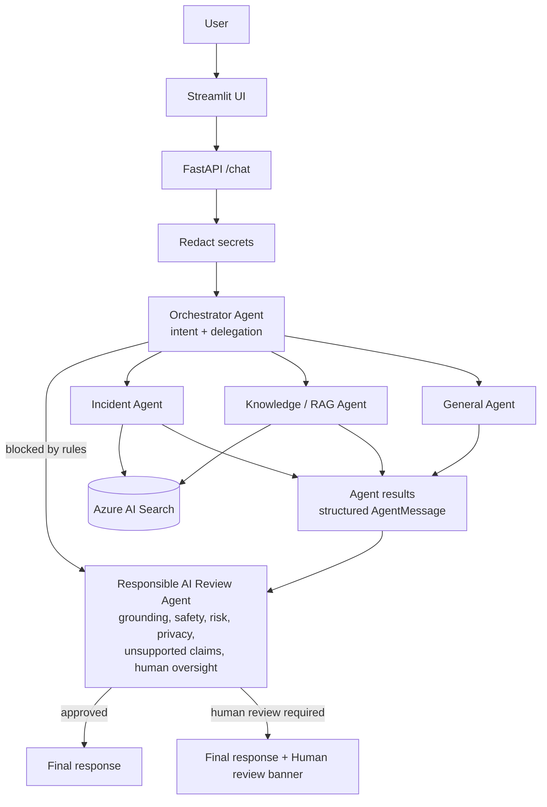

# Multi-Agent Architecture

> Portfolio project with **synthetic data**. Everything below describes what is implemented in `app/agents/`. Items marked **FUTURE** are not built.
> A live 12-case evaluation was run on 2026-10-05; results and caveats are in the README. They do not prove production reliability.

## 0. Overview

`AGENT_MODE=single` in `.env` switches back to the original single-pipeline behaviour (`app/responsible_ai.py`).

## 1. Why multi-agent architecture?
The first version had one pipeline that routed, retrieved, answered and reviewed in one function. That worked, but the pieces could not be tested or evaluated separately, and a mixed request ("VPN authentication is failing. Should we disable MFA?") could only follow one path.

With specialised agents each part has a focused responsibility, its own tools, its own failure behaviour and its own tests, and one request can use several agents. The reviewer is separate from the agents that produce the answer, so it does not mark its own homework.

## 2. Agent responsibilities

| Agent | File | Role | Input | Output | Tools | On failure | Boundary |
|---|---|---|---|---|---|---|---|
| Orchestrator | `orchestrator.py` | Understand intent, choose agents | Redacted question | `OrchestratorPlan` | Hard rules + 1 model call | Falls back to the Knowledge agent | Never answers; cannot lower a rule-set risk or un-block |
| Incident | `incident_agent.py` | Analyse an IT incident | Question | `AgentMessage`, findings labelled `KNOWN_FROM_SOURCES` / `INFERENCE` / `UNKNOWN` | `rag.retrieve` + 1 model call | `status="error"` | Advises only; an unsourced claim is downgraded to INFERENCE |
| Knowledge / RAG | `knowledge_agent.py` | Answer policy and procedure questions | Question | `AgentMessage` with source IDs and titles, or `NO_RELEVANT_KNOWLEDGE` | Existing RAG pipeline | `status="error"` | Never answers from general knowledge |
| General | `general_agent.py` | General technology questions | Question | `AgentMessage`, `GENERAL_AI_RESPONSE`, never grounded | 1 model call | `status="error"` | Must not claim anything about the company; label enforced in code |
| Responsible AI Review | `responsible_ai_agent.py` | Independent review of the combined output | Question, plan, all agent messages | `ReviewVerdict` | Rules, Azure AI Content Safety, output scan, 1 model call | Verdict stands on deterministic checks and human review is required | Model can only raise risk or add flags |

## 3. Agent communication
Agents exchange typed Pydantic messages (`app/agents/messages.py`): `AgentMessage`, `Finding`, `OrchestratorPlan`, `ReviewVerdict`, `TraceStep`. An invalid value (for example an unknown status) is rejected, so hand-offs are checked rather than parsed from free text. Agents never call each other directly; the pipeline (`pipeline.py`) runs them in the order the orchestrator planned.

## 4. Orchestrator
1. Deterministic rules run first (`router.apply_rules`). A request flagged as prompt injection, credential request or security bypass is blocked immediately: **no model call, no search, no worker agent.**
2. Otherwise one model call returns one or more query types.
3. Code then applies overrides the model cannot undo: a question that refers to "our runbook" cannot be GENERAL, and a proposal to disable a security control always adds the Knowledge agent so policy evidence is gathered.
4. Query types map to agents in a fixed order (Incident, Knowledge, General).

## 5. Incident Agent
Retrieves runbooks and past incidents, then makes one call with an incident-analyst prompt asking for likely causes, ordered troubleshooting steps and similar past incidents. Every finding carries a basis. Code enforces the labels: a "sourced" finding whose document IDs were not actually retrieved becomes an INFERENCE, and if nothing is sourced the result is `NO_RELEVANT_KNOWLEDGE`, not grounded.

## 6. Knowledge Agent
A thin wrapper over the existing RAG pipeline: hybrid Azure AI Search, the 0.65 grounding gate, a grounded prompt, citation validation and conflict detection. Nothing relevant means `NO_RELEVANT_KNOWLEDGE` and the model is not called.

## 7. General Agent
Answers concept questions ("what is cloud computing?") with no search. The "General knowledge (not from the enterprise knowledge base):" prefix is added in code if the model omits it, and its findings are tagged INFERENCE so they can never pass as enterprise evidence.

## 8. Responsible AI Agent
Two layers.
- **Deterministic floor:** plan rules, Azure AI Content Safety, output secret and prompt-leak scan, source conflicts, missing knowledge, agent outages, sensitive input.
- **Semantic review:** one model call that judges unsupported claims, risk and privacy across the combined output. Agent output is passed inside a delimited data block with an instruction to ignore any commands in it.

It returns `grounded`, `risk_level`, `safety_flags`, `privacy_flags`, `unsupported_claims`, `human_review_required`, `approved` and a short `reason` (no chain-of-thought). `approved` is true only when no human review is needed and nothing was withheld. Risk levels are a **portfolio demonstration risk classification**, not a certified framework.

**Limit:** the reviewer sees claims, labels and source IDs, not the full source text, so it judges plausibility and overreach, not word-for-word verification.

## 9. Tool usage
Azure AI Search (hybrid + vector), Azure OpenAI `gpt-4.1-mini` and `text-embedding-3-small`, and Azure AI Content Safety (inside the reviewer). Agents do not hold tools they do not need: the General agent has no search, the Orchestrator has no retrieval.

## 10. Failure handling
- A worker agent that cannot reach Search or the model returns `status="error"` and does not raise, so one failure does not crash the request. The reviewer sees the gap and requires human review.
- If the reviewer's model call fails, the deterministic verdict stands and human review is required (fail safe).
- If the orchestrator's model call fails, the plan falls back to the Knowledge agent so retrieval and the grounding gate decide.
- Azure AI Content Safety fails open to the local rules (existing behaviour), and the response notes it.
- Configuration errors still surface as an API error, as before.

## 11. Human oversight
The system does not make consequential security decisions. Review is required for risk MEDIUM or above, conflicting sources, insufficient evidence, agent outage, unsupported claims, sensitive input and blocked requests. This is deliberately stricter than "HIGH or CRITICAL only". Example: "Should we disable MFA temporarily?" is HIGH and shows *Human review recommended*.

## 12. Security
Secrets are redacted before any agent sees the text. Blocked requests never reach a model. Documents are treated as data, not instructions, in the worker prompts, and agent output is treated as data by the reviewer. Prompt injection is handled by rules before any model; Azure AI Content Safety does not detect injection (observed in testing); **Prompt Shields are FUTURE**. The deployment security design (Key Vault, managed identity, non-root container) is in [security.md](security.md).

## 13. Observability
`pipeline.py` logs one safe line per request: agents used, risk, grounded, review flag, safety flags, source count, token count. No question or answer text is logged. The response includes `agents_used` and `agent_trace` (agent, status, purpose, high-level result) for the UI. Application Insights receives telemetry when a connection string is configured. Per-agent latency metrics are **FUTURE**.

## 14. Scalability
Agents are stateless and run in the same process behind FastAPI, so the Container App scales horizontally. Workers currently run one after another. Independent agents (Incident and Knowledge) could run in parallel to cut latency (**FUTURE**). Separating agents into services is possible but not needed at this scale.

## 15. Cost considerations
Approximate model calls per request (each agent is a real call): original pipeline about 2; now a single-worker request about 3 (orchestrator, worker, reviewer) and a two-worker request about 4. A blocked request makes 0 calls; an out-of-scope question makes 1. Mitigations: rules before models, the grounding gate (weak retrieval skips the worker model), a small model, short prompts, and the reviewer skipping its call when there is nothing to review. No measured token numbers are claimed yet.

## 16. Why not a single agent?
A single agent would be cheaper and faster, and for a narrow assistant with one path it is the better choice. It was not enough here because:
- mixed requests need both incident and policy evidence,
- the reviewer should be independent of the answer producers,
- each behaviour can be tested and evaluated on its own.

**Trade-offs of multi-agent:** more latency, more tokens, more complexity, more failure points, orchestration overhead. Prefer a single agent when requests follow one path, latency or cost dominate, or no independent review is needed.

## 17. Future improvements
Run independent agents in parallel; Azure AI Content Safety Prompt Shields; claim-level verification against full source text in the reviewer; semantic ranker; per-agent metrics and tracing; a larger versioned evaluation in CI; token authentication to AI services; API Management in front of the API (**not deployed**).
